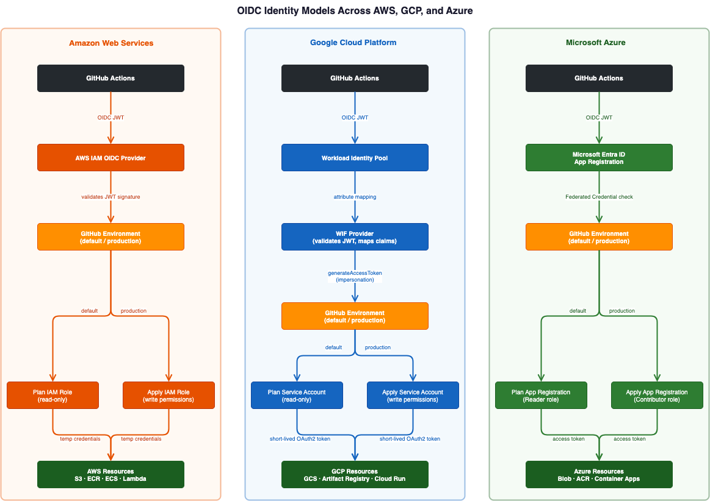
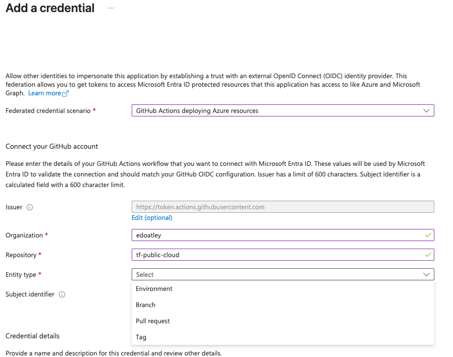

# Part 1: The Zero-Trust Multi-Cloud Foundation: Ditching Static Keys for OIDC and Automation

## Introduction: The Multi-Cloud Credential Nightmare

For a long time, CI/CD relied on generating long-lived IAM users, service accounts, and service principals. This
effectively forces teams to store sensitive secrets directly in the CI system or a vault. This operational
overhead scales poorly, especially when you are attempting to enforce least-privilege access across a multi-cloud
estate.

Beyond the manual, error-prone work for IAM administrators, the critical flaw in this approach is the blast radius 
of a leaked secret. With long-lived credentials, revocation is rarely simple or disruption-free, and the damage done
in the intervening minutes can be catastrophic. We have all seen the post-mortems: leaked keys hijacked for 
cryptomining, AI token spending sprees, or worse, enterprise data breaches that trigger severe compliance and legal 
fallout.

Trust should be based on cryptographic identity, not static passwords. OpenID Connect (OIDC) is a modern standard
that solves this by leveraging the underlying OAuth 2.0 protocol to prove identity. By adopting OIDC, we shift
from managing static secrets to requesting ephemeral, short-lived tokens. GitHub Actions presents a token that
the Cloud Service Provider (CSP) natively trusts, allowing the pipeline to temporarily adopt an identity with
a strictly scoped set of permissions.

This post covers the full foundation: how to bootstrap state backends and OIDC trust across AWS, GCP, and Azure,
how to manage permissions as code-reviewable diffs, and how to prove the entire pipeline works without provisioning
a single billable resource.

## OIDC: Trust Without Secrets

The core idea is simple: instead of handing a pipeline a password, you teach the cloud provider to
*trust a third party* — GitHub — to vouch for it.

GitHub acts as an **Identity Provider (IdP)**. When a workflow runs, GitHub mints a short-lived, signed
JSON Web Token (JWT) that describes exactly *who* is asking: which repository, which branch, which environment.
The cloud provider has been pre-configured to trust JWTs from GitHub's OIDC endpoint, so it can verify
the signature without any shared secret. If the token is valid and the claims match the rules on the IAM role
(e.g. `repo:myorg/myrepo:ref:refs/heads/main`), the cloud provider exchanges it for a set of temporary
credentials — scoped, expiring, and never stored anywhere.

From the pipeline's perspective the experience is clean: the workflow requests a token, sends it to the
cloud provider, and receives back short-lived credentials. There are no secrets to rotate, no blast radius if
a log is leaked, and the exact repository and branch that triggered the run is cryptographically baked into
every token.

The key JWT claims — `repo`, `ref`, and `environment` — are what the downstream trust policies  actually
evaluate. Getting these right is what makes the difference between broad access and a properly scoped identity.
To make the full exchange concrete, here is the sequence for AWS:


Each cloud provider has its own approach to presenting an OIDC token to Terraform, but the outcome is
identical — credentials with a short, time-based TTL (typically one hour) that are never stored anywhere 
persistent:

| Cloud | Terraform Auth Mechanism                                        | How credentials are passed                          |
| ----- | --------------------------------------------------------------- | --------------------------------------------------- |
| AWS   | `aws-actions/configure-aws-credentials` assumes an IAM Role ARN | Sets `AWS_*` environment variables                  |
| GCP   | `google-github-actions/auth` exchanges the JWT via WIF          | Writes a `GOOGLE_APPLICATION_CREDENTIALS` file      |
| Azure | No action needed — `azurerm` reads env vars directly            | Set `ARM_*` variables including `ARM_USE_OIDC=true` |

## Three Clouds, One Pattern — But the Details Differ

The composite action that handles authentication lives in `.github/actions/cloud-login/action.yml`. Each cloud
gets one step, and the inputs are passed in from the calling workflow:

**AWS:**

```yaml
- name: Authenticate to AWS
  if: inputs.cloud == 'aws'
  uses: aws-actions/configure-aws-credentials@v6
  with:
    role-to-assume: ${{ inputs.aws_role_arn }}
    aws-region: ${{ inputs.aws_region }}
```

**GCP:**

```yaml
- name: Authenticate to GCP
  if: inputs.cloud == 'gcp'
  uses: google-github-actions/auth@v3
  with:
    workload_identity_provider: ${{ inputs.gcp_wif_provider }}
    service_account: ${{ inputs.gcp_service_account }}
```

**Azure:**

```yaml
- name: Authenticate to Azure (Terraform)
  if: inputs.cloud == 'azure'
  shell: bash
  run: |
    echo "ARM_CLIENT_ID=${{ inputs.azure_client_id }}"             >> "$GITHUB_ENV"
    echo "ARM_TENANT_ID=${{ inputs.azure_tenant_id }}"             >> "$GITHUB_ENV"
    echo "ARM_SUBSCRIPTION_ID=${{ inputs.azure_subscription_id }}" >> "$GITHUB_ENV"
    echo "ARM_USE_OIDC=true"                                        >> "$GITHUB_ENV"
```

Azure is the odd one out in a different way to the others. The `azurerm` Terraform provider does not read
from an Azure CLI session — it reads `ARM_*` environment variables directly. Setting `ARM_USE_OIDC=true`
alongside the client, tenant, and subscription IDs tells the provider to request a token from the federated
credential rather than expect a client secret. No official action is required, just four environment variables
for Terraform to use.

Note: the composite `cloud-login` action in my code does also call `azure/login` to establish a CLI session, 
but that is only needed by other workflows that use `az` commands directly — such as `az acr login` in the container
build pipeline. For Terraform authentication, it is entirely superfluous.

While the interface is uniform, each cloud has a different identity model underneath:



**AWS** has the simplest model. One OIDC provider is registered in IAM, and two roles are created — one for
`plan`, one for `apply` — each with separate trust policies and permission boundaries.

The **plan role** uses a broad wildcard, trusting any ref in the repo:

```json
"StringLike": {
  "token.actions.githubusercontent.com:sub": "repo:edoatley/tf-public-cloud:*"
}
```

This breadth is intentional: plan must run on PRs, feature branches, and dispatch events. Because the
plan role's permissions are entirely read-only, the wide trust policy carries no risk — credentials
issued to a PR workflow simply cannot mutate anything. The role separation is the control, not the trust
scope.

The **apply role** is a different story. It carries write permissions, so its trust policy is scoped
precisely to the `production` GitHub environment:

```json
"StringEquals": {
  "token.actions.githubusercontent.com:sub": "repo:edoatley/tf-public-cloud:environment:production"
}
```

Any workflow job that wants to assume this role must declare `environment: production`. GitHub then
enforces the environment's protection rules — required reviewers, deployment branch restrictions —
before issuing the OIDC token. The IAM trust policy and the environment gate are independent controls:
both must pass. A compromised workflow or a mistaken `if:` condition cannot escalate to a write
operation because the trust policy will reject any token not carrying the environment sub claim.

This mirrors the Azure approach exactly — both clouds now use environment-scoped trust for their
write-capable identities, making the identity model consistent across the two clouds.

**GCP** adds an extra layer of indirection via Workload Identity Federation. The JWT goes first to a WIF Pool,
then to a WIF Provider (which validates the token and maps claims), and finally triggers impersonation of a
Service Account. The pool abstraction is genuinely useful: you can rotate or swap the upstream IdP without
touching any of the Service Account's IAM bindings. The attribute mapping `assertion.repository` scopes trust
to a specific repo at the provider level.

**Azure** is where you hit the biggest 'gotcha'. Azure federated credentials are scoped to a single entity type
per rule — you must choose Branch, Pull Request, Environment, or Tag. In contrast, AWS accepts a wildcard `repo:org/repo:*`
that covers all of these in one rule; Azure does not allow a single subject to span multiple entity types.



The cleanest solution is to scope the credential to `Environment: default`, which covers every workflow job
that declares `environment: default`. Looking at the resulting subject identifier confirms it:
`repo:edoatley/tf-public-cloud:environment:default`. The Azure workflow job must declare this explicitly:

```yaml
deploy-azure:
  runs-on: ubuntu-latest
  environment: default        # required — matches the federated credential subject
  env:
    TF_VAR_subscription_id: ${{ vars.AZURE_SUBSCRIPTION_ID }}
```

---

## The Bootstrap: Solving the Chicken-and-Egg Problem

Here is the problem every IaC project faces: Terraform needs infrastructure to run — state buckets, OIDC
providers, IAM roles — but you need to run something to create that infrastructure in the first place.

My chosen solution was three idempotent bash scripts in `scripts/bootstrap/`, one per cloud. Run once by a human with
sufficient permissions using their local CLI credentials. Each script is safe to re-run as the scripts check for the
existence of every resource before creating it. This was useful as when missing permissions, providers etc were
found while building this they could be added by rerunning the script.

```sh
./scripts/bootstrap/bootstrap-aws.sh   # S3 bucket + OIDC provider + 2 IAM roles (plan + apply)
./scripts/bootstrap/bootstrap-gcp.sh   # GCS bucket + WIF pool + provider + Service Account
./scripts/bootstrap/bootstrap-azure.sh # Storage account + 2 App Registrations + 2 Federated Credentials
```

The more interesting design decision is how permissions are managed. Rather than embedding IAM policy logic
inside the bootstrap scripts, permissions live as plain JSON files in `scripts/iam/` and are applied by
dedicated idempotent scripts. The AWS plan role policy starts here:

```json
{
  "Sid": "StateRead",
  "Effect": "Allow",
  "Action": ["s3:GetObject", "s3:ListBucket", "s3:GetBucketAcl"],
  "Resource": [
    "arn:aws:s3:::tf-public-cloud-aws-state-edo",
    "arn:aws:s3:::tf-public-cloud-aws-state-edo/*"
  ]
}
```

The benefit is practical: a security reviewer can audit permissions as a straightforward JSON diff. There is
no bash logic to trace, and no conditionals to reason about. When the architecture evolves and a new permission
is needed, you simply add it to the JSON file and re-run the apply script — no complex re-bootstrap required:

```sh
./scripts/bootstrap/apply-aws-iam-policy.sh \
  github-tf-public-cloud-plan \
  scripts/iam/aws-plan-policy.json
```

The same pattern holds for GCP (`apply-gcp-iam-bindings.sh`) and Azure (`apply-azure-rbac.sh`), each
with their own idempotent apply and remove semantics.

---

## Proving the Foundation: The Smoke Test

Before deploying any real resources, you need to know the plumbing actually works. The smoke-test modules
exist for exactly this purpose. They contain only Terraform `data` sources — nothing billable, nothing
destructive and nothing beyond a successful plan output.

```hcl
# aws/smoke-test/main.tf
data "aws_caller_identity" "current" {}
data "aws_region" "current" {}
data "aws_partition" "current" {}
```

The outputs do the heavy lifting: the `caller_arn` output confirms which IAM role was actually assumed:

```hcl
output "caller_arn" {
  description = "ARN of the IAM identity used by the runner."
  value       = data.aws_caller_identity.current.arn
}
```

Trigger the smoke test across all three clouds simultaneously with a single `gh` command:

```sh
gh workflow run plan-resource.yml \
  --field resource_type=smoke-test \
  --field cloud=all
```

A passing run proves three things in one go:

1. **OIDC token exchange is working** — the correct role or service account was assumed.
2. **Remote state is accessible** — `terraform init` authenticated to the state backend.
3. **Live provider data resolves** — `terraform plan` completed against real cloud APIs.

| Cloud | Data sources                                         | What it confirms                           |
| ----- | ---------------------------------------------------- | ------------------------------------------ |
| AWS   | `aws_caller_identity`, `aws_region`, `aws_partition` | Role ARN, account ID, region               |
| GCP   | `google_project`, `google_client_openid_userinfo`    | Project ID/number, service account email   |
| Azure | `azurerm_subscription`, `azurerm_client_config`      | Subscription ID/name, tenant ID, object ID |

Zero resources created. Zero cost. Full confidence the foundation holds.

## What's Next

You now have a secure, zero-trust foundation. Three clouds, three state backends, OIDC federation configured
end-to-end, permissions managed as reviewable JSON diffs, and a smoke test that proves the whole chain without
touching production infrastructure. Not a single static credential lives in GitHub.

In Part 2, we move from plumbing to primitives — deploying real resources and comparing the fundamental
building blocks of cloud infrastructure: object storage and virtual machines across all three providers.

---

*The full source for this series is available at [github.com/edoatley/tf-public-cloud](https://github.com/edoatley/tf-public-cloud).*
