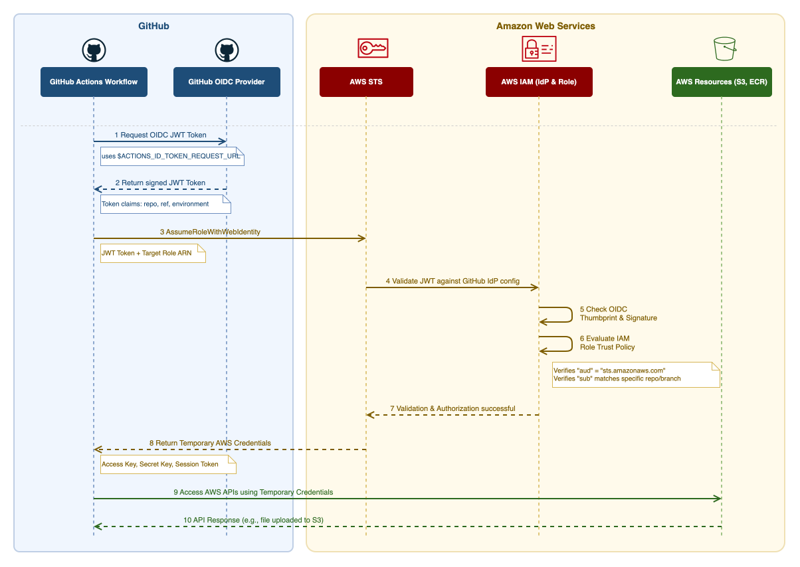

# Part 1: The Zero-Trust Multi-Cloud Foundation: Ditching Static Keys for OIDC and Automation

## Introduction: The Multi-Cloud Credential Nightmare

For a long time, CI/CD relied on generating long-lived IAM users, service accounts, and service
principals. This effectively forces teams to store sensitive secrets directly in the CI system
or a vault. This operational overhead scales poorly, especially when you are attempting to
enforce least-privilege access across a multi-cloud estate.

Beyond the manual, error-prone work for IAM administrators, the critical flaw in this approach
is the blast radius of a leaked secret. With long-lived credentials, revocation is rarely
simple or disruption-free, and the damage done in the intervening minutes can be catastrophic.
We have all seen the post-mortems: leaked keys hijacked for cryptomining, AI token spending
sprees, or worse, enterprise data breaches that trigger severe compliance and legal fallout.

Trust *should* be based on cryptographic identity, not static passwords. OpenID Connect (OIDC)
is a modern standard that solves this by leveraging the underlying OAuth 2.0 protocol to prove
identity. By adopting OIDC, we shift from managing static secrets to requesting ephemeral,
short-lived tokens. GitHub Actions presents a token that the Cloud Service Provider (CSP)
natively trusts, allowing the pipeline to temporarily adopt an identity with a strictly scoped
set of permissions.

This post covers the full foundation: how to bootstrap state backends and OIDC trust across
AWS, GCP, and Azure, how to manage permissions as code-reviewable diffs, and how to prove the
entire pipeline works without provisioning a single billable resource.

## OIDC: Trust Without Secrets

The core idea is simple: instead of handing a pipeline a password, you teach the cloud provider
to *trust a third party* — GitHub — to vouch for it.

GitHub acts as an **Identity Provider (IdP)**. When a workflow runs, GitHub mints a short-lived
signed JWT and presents it to the cloud provider, which verifies the signature against GitHub's
public OIDC endpoint — no shared secret required. If the claims match the trust policy on the
IAM role, the cloud exchanges the token for temporary credentials that are scoped, expiring,
and never stored anywhere.

Here is what that JWT payload actually looks like:

```json
{
  "jti": "6f4b4b3e-1234-5678-abcd-ef0123456789",
  "sub": "repo:edoatley/tf-public-cloud:environment:production",
  "aud": "https://github.com/edoatley",
  "ref": "refs/heads/main",
  "sha": "abc123def456...",
  "repository": "edoatley/tf-public-cloud",
  "repository_owner": "edoatley",
  "run_id": "9876543210",
  "run_number": "42",
  "actor": "edoatley",
  "workflow": "Terraform",
  "job_workflow_ref": "edoatley/tf-public-cloud/.github/workflows/terraform.yml@refs/heads/main",
  "environment": "production",
  "iss": "https://token.actions.githubusercontent.com",
  "nbf": 1700000000,
  "exp": 1700003600,
  "iat": 1700000000
}
```

The trust policy on the IAM role evaluates a subset of these claims — typically `sub`, `ref`,
and `environment` — to decide whether to grant access. The `exp` field means the token is
useless within the hour; there is nothing to rotate or revoke. To make the full exchange
concrete, here is the sequence for AWS:



Each cloud provider has its own approach to presenting an OIDC token to Terraform, but the
outcome is identical — credentials with a short, time-based TTL (typically one hour) that are
never stored anywhere persistent:

| Cloud | Terraform Auth Mechanism                                                              | How credentials are passed                                                       |
| ----- | ------------------------------------------------------------------------------------- | -------------------------------------------------------------------------------- |
| AWS   | `aws-actions/configure-aws-credentials` assumes an IAM Role ARN                       | Sets `AWS_*` environment variables                                               |
| GCP   | `google-github-actions/auth` exchanges the JWT via Workload Identity Federation (WIF) | Writes a `GOOGLE_APPLICATION_CREDENTIALS` file                                   |
| Azure | `azurerm` provider reads `ARM_*` env vars with `ARM_USE_OIDC=true`                    | Set `ARM_CLIENT_ID`, `ARM_TENANT_ID`, `ARM_SUBSCRIPTION_ID`, `ARM_USE_OIDC=true` |

## Three Clouds, One Pattern — But the Details Differ

While the high-level OIDC pattern is identical, the implementation diverges quickly. We need to
look at this through two lenses: **Authentication** (how the pipeline presents the token) and
**Authorization** (how the cloud provider decides to trust it).

### Authentication: Exchanging the Token

I built a composite action to handle the initial login, it lives in
`.github/actions/cloud-login/action.yml`. Each cloud gets one step, and the inputs are passed
in from the calling workflow.

AWS and GCP use official GitHub Actions, while Azure takes a slightly different path:

**AWS:**

```yaml
- name: Authenticate to AWS
  if: inputs.cloud == 'aws'
  uses: aws-actions/configure-aws-credentials@v6
  with:
    role-to-assume: ${{ inputs.aws_role_arn }}
    aws-region: ${{ inputs.aws_region }}

```

**GCP:**

```yaml
- name: Authenticate to GCP
  if: inputs.cloud == 'gcp'
  uses: google-github-actions/auth@v3
  with:
    workload_identity_provider: ${{ inputs.gcp_wif_provider }}
    service_account: ${{ inputs.gcp_service_account }}

```

**Azure:**

```yaml
- name: Authenticate to Azure (Terraform)
  if: inputs.cloud == 'azure'
  shell: bash
  run: |
    echo "ARM_CLIENT_ID=${{ inputs.azure_client_id }}"             >> "$GITHUB_ENV"
    echo "ARM_TENANT_ID=${{ inputs.azure_tenant_id }}"             >> "$GITHUB_ENV"
    echo "ARM_SUBSCRIPTION_ID=${{ inputs.azure_subscription_id }}" >> "$GITHUB_ENV"
    echo "ARM_USE_OIDC=true"                                        >> "$GITHUB_ENV"

```

Notice that the `azurerm` Terraform provider does not require a dedicated GitHub Action. It
reads `ARM_*` environment variables directly. Setting `ARM_USE_OIDC=true` alongside the client,
tenant, and subscription IDs tells the provider to request a token from the federated
credential rather than expect a client secret.

### Authorization: Trust Policies and the Plan/Apply Split

Once the token is presented, the cloud provider's identity model takes over.

Despite the different underlying mechanisms, we enforce a strict architectural pattern across
all three clouds: **two identities per cloud**. One identity is for `plan` operations, and one
is for `apply` operations. The `apply` identity is firmly gated behind the `production` GitHub
environment.

The key design insight here is that **read-only identities can safely have broad trust
scopes**. The breadth of the trust policy is irrelevant when the `plan` identity carries no
write permissions—it allows `plan` to run smoothly on PRs, feature branches, and dispatch
events. The **write identity**, by contrast, must be strictly scoped and only reachable via a
trusted subject claim.

**AWS** implements this with IAM roles and trust policies. The plan role uses a broad wildcard:

```json
"StringLike": {
  "token.actions.githubusercontent.com:sub": "repo:edoatley/tf-public-cloud:*"
}

```

The apply role uses `StringEquals` scoped strictly to the `production` environment subject:

```json
"StringEquals": {
  "token.actions.githubusercontent.com:sub": "repo:edoatley/tf-public-cloud:environment:production"
}

```

**GCP** adds an extra layer of indirection via Workload Identity Federation. The JWT goes first
to a WIF Pool, then to a WIF Provider which validates the token and maps OIDC claims to Google
attributes. The mapped attributes are then used to scope trust on each Service Account via a
`principalSet` binding.

The plan Service Account is bound via the repository attribute—any token from this repo can
impersonate it:

```text
principalSet://iam.googleapis.com/.../attribute.repository/edoatley/tf-public-cloud

```

The apply Service Account is bound via the environment attribute—only tokens carrying
`environment:production` qualify:

```text
principalSet://iam.googleapis.com/.../attribute.environment/production

```

*(Note: `attribute.environment` must be explicitly added to the WIF provider's attribute
mapping; it is not mapped by default.)*

**Azure** is where you hit the biggest 'gotcha' with the broad read-only approach. Azure
federated credentials are scoped to a single entity type per rule—you must choose Branch, Pull
Request, Environment, or Tag. A wildcard like `repo:org/repo:*` that covers all entity types in
one rule is not supported.

However, this constraint works in our favour. Two App Registrations, each with a single
federated credential scoped to an environment, maps perfectly onto our plan/apply pattern. The
plan app trusts `environment:default` and the apply app trusts `environment:production`.

The workflow job declares the environment, which determines which App Registration's credential
is matched—and therefore which RBAC permissions are granted:

```yaml
# issues token matching the plan app's federated credential
plan-azure:
  environment: default

```

```yaml
# issues token matching the apply app's federated credential
apply-azure:
  environment: production

```

Both environments must be created in the GitHub repository settings before the federated
credentials will match. The bootstrap script handles this automatically via the `gh` CLI:

```sh
gh api --method PUT repos/edoatley/tf-public-cloud/environments/default
gh api --method PUT repos/edoatley/tf-public-cloud/environments/production

```

The `production` environment is where you configure reviewer approval and deployment branch/tag
restrictions such as a human approval gate that sits in front of the IAM trust condition.

## The Bootstrap: Solving the Chicken-and-Egg Problem

Every IaC project faces a bootstrap problem: Terraform needs infrastructure to run — state
buckets, OIDC providers, IAM roles — but you need to run something to create that
infrastructure in the first place.

To solve this without creating an unmaintainable mess of shell logic, the setup is divided into
two distinct layers: one-time foundation bootstrapping, and ongoing declarative permission
management.

The foundation layer consists of three bash scripts in scripts/bootstrap/, one per cloud. A
human with local CLI credentials runs the relevant script once to establish the core
infrastructure. While they are completely idempotent and safe to re-run if core resources are
ever accidentally deleted, their primary purpose is simply getting the lights on:

```sh
./scripts/bootstrap/bootstrap-aws.sh   # S3 bucket + OIDC provider + 2 IAM roles (plan + apply)
./scripts/bootstrap/bootstrap-gcp.sh   # GCS bucket + WIF pool + provider + 2 Service Accounts (plan + apply)
./scripts/bootstrap/bootstrap-azure.sh # Storage account + 2 App Registrations + 2 Federated Credentials (plan + apply)
```

Once that foundation is laid, you rarely need to touch those scripts again. The real power of
this setup is how it handles the day-to-day evolution of the pipeline: managing permissions.

Instead of burying IAM policy logic deep inside shell scripts, this project standardizes on
declarative permissions managed strictly via plain JSON files in `scripts/iam/`. The bootstrap
scripts then take these JSON files and apply them. How this works under the hood depends on the
cloud:

* **AWS:** Natively expects JSON policy documents, so the script directly applies the
  file to the IAM role.
* **GCP and Azure:** The JSON files act as a bespoke, declarative wrapper for this
  project. The bootstrap scripts read this standardized JSON and translate it into the
  appropriate `gcloud` or `az` CLI commands to apply IAM bindings and RBAC assignments.

For example, the AWS plan role policy starts here:

```json
{
  "Sid": "StateRead",
  "Effect": "Allow",
  "Action": ["s3:GetObject", "s3:ListBucket", "s3:GetBucketAcl"],
  "Resource": [
    "arn:aws:s3:::tf-public-cloud-aws-state-edo",
    "arn:aws:s3:::tf-public-cloud-aws-state-edo/*"
  ]
}

```

When the architecture evolves and a new permission is needed, you simply add it to the JSON
file and re-run the apply script—no complex re-bootstrap required:

```sh
./scripts/bootstrap/apply-aws-iam-policy.sh \
  github-tf-public-cloud-plan \
  scripts/iam/aws-plan-policy.json

```

By maintaining separate files for `plan` and `apply` operations (e.g.,
`gcp-plan-permissions.json` vs. `gcp-apply-permissions.json`), the architectural benefit
becomes practical and immediate. A security reviewer can audit the privilege split and any
subsequent permission changes as a straightforward JSON diff, without needing to decipher a
single line of bash logic.

## Proving the Foundation: The Smoke Test

Before deploying any real resources, you need to know the plumbing actually works. The
smoke-test modules exist for exactly this purpose. They contain only Terraform `data` sources —
nothing billable, nothing destructive, and nothing beyond a successful plan output.

```hcl
# aws/smoke-test/main.tf
data "aws_caller_identity" "current" {}
data "aws_region" "current" {}
data "aws_partition" "current" {}
```

The outputs do the heavy lifting: the `caller_arn` output confirms which IAM role was actually
assumed:

```hcl
output "caller_arn" {
  description = "ARN of the IAM identity used by the runner."
  value       = data.aws_caller_identity.current.arn
}
```

Trigger the smoke test across all three clouds simultaneously with a single `gh` command:

```sh
gh workflow run plan-resource.yml \
  --field resource_type=smoke-test \
  --field cloud=all
```

A passing run proves three things in one go:

1. **OIDC token exchange is working** — the correct role or service account was assumed.
2. **Remote state is accessible** — `terraform init` authenticated to the state backend and obtains a lock.
3. **Live provider data resolves** — `terraform plan` completed against real cloud APIs.

| Cloud | Data sources                                         | What it confirms                           |
| ----- | ---------------------------------------------------- | ------------------------------------------ |
| AWS   | `aws_caller_identity`, `aws_region`, `aws_partition` | Role ARN, account ID, region               |
| GCP   | `google_project`, `google_client_openid_userinfo`    | Project ID/number, service account email   |
| Azure | `azurerm_subscription`, `azurerm_client_config`      | Subscription ID/name, tenant ID, object ID |

All without creating any resources or incurring cost whilst establishing full confidence the zero-trust foundation is solid.

## What's Next

You now have a secure, zero-trust foundation for each of the three clouds, each with: state backends, OIDC
federation configured end-to-end, permissions managed as reviewable JSON diffs, and a smoke
test that proves the whole chain without touching production infrastructure. Not a single
static credential lives in GitHub.

In Part 2, we move from plumbing to primitives — deploying real resources and comparing the
fundamental building blocks of cloud infrastructure: object storage and virtual machines across
all three providers.

---

*The full source for this series is available at
[github.com/edoatley/tf-public-cloud](https://github.com/edoatley/tf-public-cloud).*
