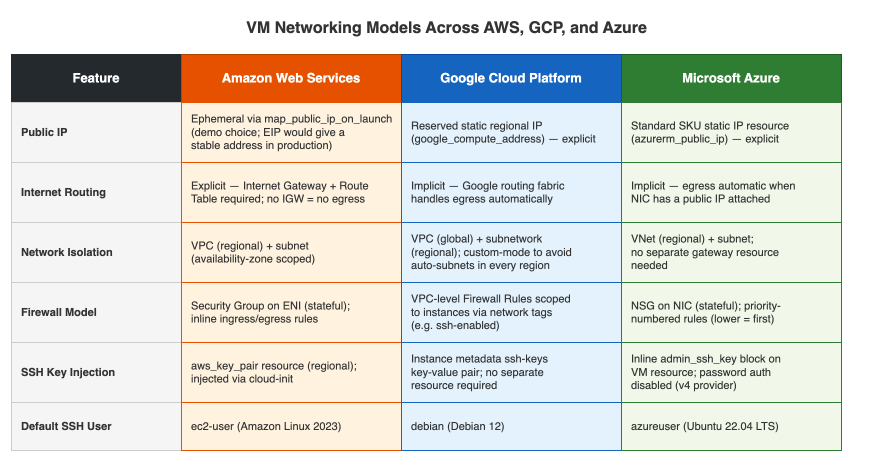
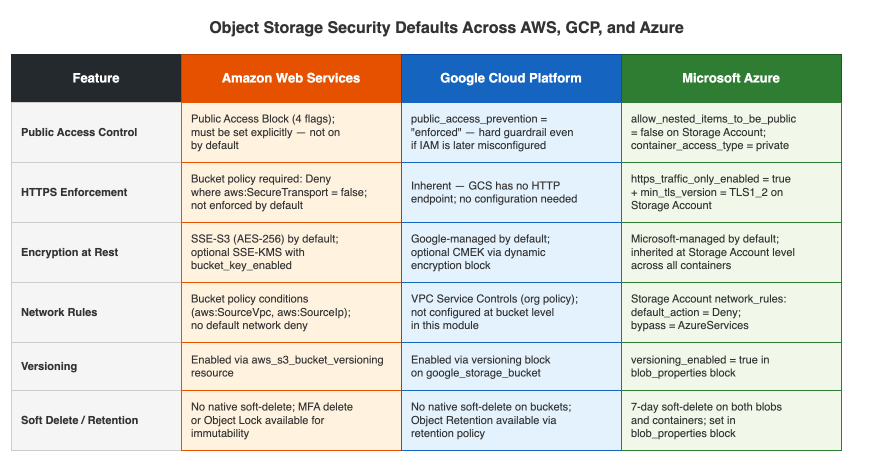

# Part 2: Cloud Primitives in Practice: The Hidden Variances of Storage and Compute

## Introduction: The Illusion of Commoditization

At first glance, public cloud primitives look identical. A virtual machine is just a slice of CPU and RAM and object
storage is just a bucket. It is tempting to treat AWS EC2, GCP Compute Engine, and Azure Virtual Machines as
interchangeable commodities.

In practice, this assumption breaks down the moment you start writing Infrastructure as Code (IaC). The underlying
networking fabrics, identity boundaries, and operational APIs of the big three cloud providers are fundamentally
different. A production-grade multi-cloud deployment requires understanding how these platforms behave under the hood.

In this post, we will deploy the absolute minimum primitives — a single virtual machine and a private object storage
bucket — across AWS, GCP, and Azure. These are deliberately minimal examples, not production blueprints; some choices
(instance size, ephemeral IPs, open SSH ingress) exist purely to keep the code readable. By keeping the use case simple,
the architectural variances between the platforms become easy to identify.

## The Network Fabric: Implicit vs. Explicit Routing

You cannot boot a virtual machine without a network. How each cloud handles that foundational network dictates how much
boilerplate infrastructure you must manage.

**AWS** demands explicit networking. To give an EC2 instance internet access, you must construct a Virtual Private Cloud
(VPC), carve out a public subnet, deploy an Internet Gateway (IGW), and explicitly route traffic to it. Without that IGW,
your instance is a dark box, regardless of whether it has a public IP. For this demo, we use `map_public_ip_on_launch = true`
on the subnet — the simplest way to get an internet-reachable instance. The trade-off is that the IP is ephemeral and 
changes on stop/start; a production deployment would use an Elastic IP instead.

```hcl
resource "aws_vpc" "this" {
  cidr_block = var.vpc_cidr
}

resource "aws_internet_gateway" "this" {
  vpc_id = aws_vpc.this.id
}

resource "aws_subnet" "public" {
  vpc_id                  = aws_vpc.this.id
  cidr_block              = var.subnet_cidr
  map_public_ip_on_launch = true
}

resource "aws_route_table" "public" {
  vpc_id = aws_vpc.this.id

  route {
    cidr_block = "0.0.0.0/0"
    gateway_id = aws_internet_gateway.this.id
  }
}
```

**GCP** operates on a global VPC model with an implicit routing fabric. We create a custom-mode VPC (to prevent GCP from
automatically creating subnets in every global region) and a regional subnetwork. There is no explicit "Internet Gateway"
resource to manage — outbound routing is handled automatically by Google's network. Furthermore, instances do not get
public IPs by default; we explicitly attach a reserved, static regional IP (`google_compute_address`) that survives restarts.

```hcl
resource "google_compute_network" "this" {
  name                    = "${var.name_prefix}-vpc-${random_id.suffix.hex}"
  auto_create_subnetworks = false
}

resource "google_compute_subnetwork" "public" {
  name          = "${var.name_prefix}-subnet-${random_id.suffix.hex}"
  ip_cidr_range = var.network_cidr
  region        = var.region
  network       = google_compute_network.this.id
}

resource "google_compute_address" "this" {
  name   = "${var.name_prefix}-ip-${random_id.suffix.hex}"
  region = var.region
}
```

**Azure** sits somewhere in the middle. We provision a Virtual Network (VNet) and a subnet. Like GCP, outbound internet 
access is implicit if the virtual machine's Network Interface (NIC) has a public IP attached. For this, we provision a 
`Standard` SKU static public IP, as the older `Basic` tier is being deprecated.

```hcl
resource "azurerm_virtual_network" "this" {
  name          = "${var.name_prefix}-vnet-${random_id.suffix.hex}"
  address_space = [var.address_space]
  location      = azurerm_resource_group.this.location
}

resource "azurerm_public_ip" "this" {
  name              = "${var.name_prefix}-pip-${random_id.suffix.hex}"
  location          = azurerm_resource_group.this.location
  allocation_method = "Static"
  sku               = "Standard"
}
```



*AWS requires an explicit Internet Gateway and route table for any internet-bound traffic. GCP routes automatically — no
gateway resource exists. Azure routes automatically too, but requires an explicit public IP resource to be created and 
attached to the NIC.*

## Securing the Perimeter and Injecting Keys

Getting a machine online is only half the battle; the other half is securely accessing it. SSH key management and firewalling reveal drastically different security models.

| Cloud     | Firewall Scope                                                                        | SSH Key Injection Mechanism                                 | Default User |
| --------- | ------------------------------------------------------------------------------------- | ----------------------------------------------------------- | ------------ |
| **AWS**   | **Security Groups:** Attached directly to the Elastic Network Interface (ENI).        | Regional `aws_key_pair` resource injected via `cloud-init`. | `ec2-user`   |
| **GCP**   | **Firewall Rules:** Applied at the VPC level, targeted via instance network tags.     | Raw instance metadata (`ssh-keys` key-value pair).          | `debian`     |
| **Azure** | **Network Security Groups (NSGs):** Attached to the NIC or subnet via priority rules. | Inline `admin_ssh_key` block directly on the VM resource.   | `azureuser`  |

**The Architectural Takeaway:** GCP's tag-based firewalling is a massive operational advantage in complex environments. 
By attaching the `ssh-enabled` tag to the instance, the VPC-level firewall rule dynamically applies to it. This decouples
security rules from instance creation. Conversely, Azure requires a strict priority numbering system for NSG rules, and 
AWS ties stateful Security Groups directly to the network interface.

```hcl
# GCP: firewall rule targets instances by tag, not by ID
resource "google_compute_firewall" "ssh" {
  name    = "${var.name_prefix}-allow-ssh-${random_id.suffix.hex}"
  network = google_compute_network.this.id

  allow {
    protocol = "tcp"
    ports    = ["22"]
  }

  source_ranges = ["0.0.0.0/0"]
  target_tags   = ["ssh-enabled"]   # applies to any instance with this tag
}

resource "google_compute_instance" "this" {
  # ...
  tags = ["ssh-enabled"]

  metadata = {
    ssh-keys = "debian:${base64decode(var.ssh_public_key_b64)}"
  }
}
```

Furthermore, none of our Terraform modules generate SSH keys. Generating cryptographic keys in IaC inherently leaks them into
the Terraform state file in plaintext. Instead, the public key is injected at runtime via CI/CD variables, keeping the state
clean and the private key safely isolated.

One more hardening detail worth noting on AWS: IMDSv2 is enforced on every instance by setting `http_tokens = "required"`.
This blocks any code running on the instance from querying instance metadata without first obtaining a session token —
closing a common lateral-movement vector that has featured in several high-profile cloud breaches.

```hcl
resource "aws_instance" "this" {
  # ...
  metadata_options {
    http_tokens = "required"
  }
}
```

## Resolving Machine Images Safely

Hardcoding a Machine Image ID (like an AWS AMI ID) is a classic IaC anti-pattern. Images are constantly patched and updated,
and IDs vary by region. If you hardcode an ID, your module will eventually rot.

Here is how we resolve the latest OS images dynamically at plan-time across the three providers:

**AWS** uses the `aws_ami` data source, filtering by name pattern and restricting owners to `amazon` to ensure we grab the
latest verified Amazon Linux 2023 image:

```hcl
data "aws_ami" "amazon_linux_2023" {
  most_recent = true
  owners      = ["amazon"]

  filter {
    name   = "name"
    values = ["al2023-ami-*-x86_64"]
  }

  filter {
    name   = "architecture"
    values = ["x86_64"]
  }
}
```

**GCP** leverages "image families" (`family = "debian-12"`, `project = "debian-cloud"`). The family pointer is maintained by
 the OS publisher and always resolves to the latest non-deprecated image automatically — no filter logic needed.

**Azure** uses the `source_image_reference` block with `version = "latest"`. The platform resolves the most recent image for
the specified publisher/offer/SKU (Canonical's Ubuntu 22.04 LTS gen2) dynamically during deployment. One subtlety: Canonical
restructured their Azure Marketplace offering in 2022, so the correct offer name is the non-obvious `0001-com-ubuntu-server-jammy`
rather than anything resembling "ubuntu".

## Object Storage: Beyond the Bucket

Now let's look at object storage. While the concept of a bucket is universal, securing it is not. In a modern enterprise, an
open S3 bucket is a resume-generating event.

**AWS S3** requires active effort to lock a bucket down. HTTPS enforcement is not on by default — we must inject a bucket 
policy that explicitly denies any request where `aws:SecureTransport = false`. Crucially, the public access block must be applied
first (enforced via `depends_on`) to avoid a race condition where the policy attachment fails because the block is not yet committed:

```hcl
resource "aws_s3_bucket_public_access_block" "this" {
  bucket                  = aws_s3_bucket.this.id
  block_public_acls       = true
  ignore_public_acls      = true
  block_public_policy     = true
  restrict_public_buckets = true
}

resource "aws_s3_bucket_policy" "https_only" {
  bucket     = aws_s3_bucket.this.id
  depends_on = [aws_s3_bucket_public_access_block.this]

  policy = jsonencode({
    Version = "2012-10-17"
    Statement = [{
      Sid       = "DenyNonHTTPS"
      Effect    = "Deny"
      Principal = "*"
      Action    = "s3:*"
      Resource  = [aws_s3_bucket.this.arn, "${aws_s3_bucket.this.arn}/*"]
      Condition = {
        Bool = { "aws:SecureTransport" = "false" }
      }
    }]
  })
}
```

**GCP Cloud Storage** is notably cleaner. We enforce `uniform_bucket_level_access = true`, completely disabling legacy per-object
ACLs in favour of IAM. We also set `public_access_prevention = "enforced"` as a hard guardrail that persists even if uniform access
is later changed. GCS only serves traffic over HTTPS — there is no HTTP endpoint to block:

```hcl
resource "google_storage_bucket" "this" {
  name    = "${var.bucket_name}-${random_id.suffix.hex}"
  project = var.project

  uniform_bucket_level_access = true
  public_access_prevention    = "enforced"

  versioning {
    enabled = true
  }
}
```

**Azure Blob Storage** requires a strict three-level hierarchy: Resource Group → Storage Account → Blob Container. We configure the
Storage Account to enforce HTTPS and TLS 1.2 as minimum transport, and apply a 7-day soft-delete retention policy for both blobs
and containers as a safety net against accidental deletion:

```hcl
resource "azurerm_storage_account" "this" {
  name                = "${var.storage_account_name}${random_id.suffix.hex}"
  resource_group_name = azurerm_resource_group.this.name

  https_traffic_only_enabled      = true
  min_tls_version                 = "TLS1_2"
  allow_nested_items_to_be_public = false

  blob_properties {
    versioning_enabled = true

    delete_retention_policy {
      days = 7
    }

    container_delete_retention_policy {
      days = 7
    }
  }
}
```



*AWS requires multiple explicit resources to achieve a locked-down bucket: a public access block, a bucket policy, and server-side 
encryption — none of which are on by default. GCP achieves equivalent security with two inline properties. Azure enforces HTTPS and 
TLS at the Storage Account tier, meaning every container it hosts inherits these controls automatically.*

## Seeing It Work: CLI Operations

With the buckets deployed, the proof is in the operational behaviour. Each cloud has a helper script in `scripts/examples/` that runs
the same four-step sequence: upload, overwrite, read back, and delete. The scripts are called directly with the bucket name from
`terraform output`.

The overwrite step is where you feel the difference between platforms:

```sh
# AWS — implicit overwrite
aws s3 cp v2.txt s3://my-bucket/demo/hello.txt

# GCP — implicit overwrite
gcloud storage cp v2.txt gs://my-bucket/demo/hello.txt

# Azure — explicit flag required
az storage blob upload \
  --account-name my-account --container-name data \
  --name demo/hello.txt --file v2.txt \
  --auth-mode login --overwrite
```

The `--overwrite` is necessary here as the Azure upload command throws a `ResourceExistsError` if it detects
duplication. This is an important difference and operational source of confusion for for teams moving from 
AWS or GCP.

Running the AWS script against a freshly deployed bucket produces output like this:

```
==> Upload
upload: /tmp/v1.txt to s3://tf-public-cloud-object-storage-32f9/demo/hello.txt
==> Update (overwrite)
upload: /tmp/v2.txt to s3://tf-public-cloud-object-storage-32f9/demo/hello.txt
==> Read back
download: s3://tf-public-cloud-object-storage-32f9/demo/hello.txt to /tmp/downloaded.txt
Downloaded content: updated content
==> Delete object
delete: s3://tf-public-cloud-object-storage-32f9/demo/hello.txt
==> Empty bucket (all versions and delete markers)
==> Done
```

The versioning configuration means both uploads are preserved as object versions — the delete step creates a delete marker, and the cleanup
 step removes all versions and markers before the bucket can be destroyed cleanly.

## What's Next

The "primitives" of the cloud are anything but primitive. Building reliable IaC requires acknowledging and engineering around these
platform-specific idiosyncrasies.

With identity federation established and our base compute and storage operational, we are ready to tackle the abstraction layer that powers
modern application delivery. In Part 3, we will explore the massive spectrum of operational complexity between running containerised apps on
heavyweight orchestration frameworks versus serverless container platforms.

---

*The full Terraform modules and validation scripts for these primitives are available at [github.com/edoatley/tf-public-cloud](https://github.com/edoatley/tf-public-cloud).*
