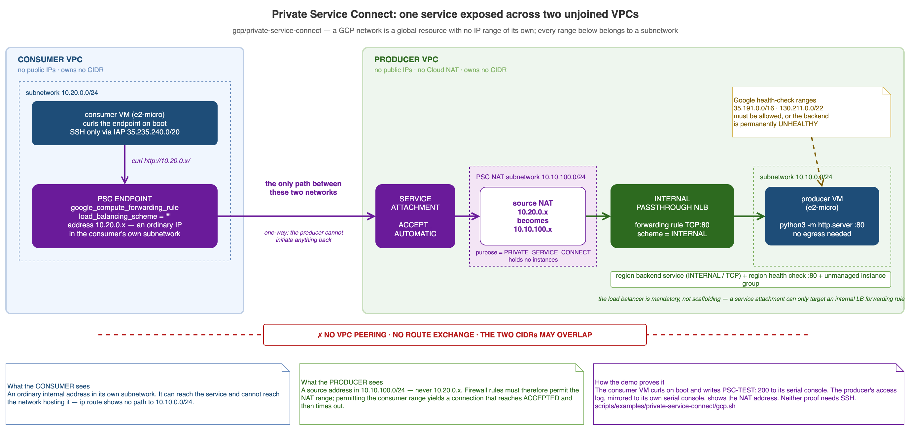
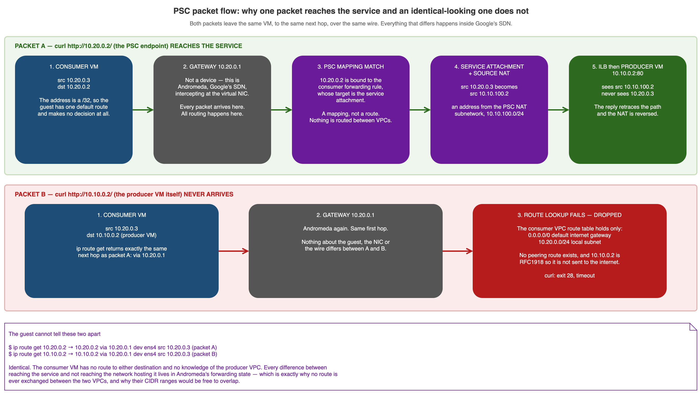
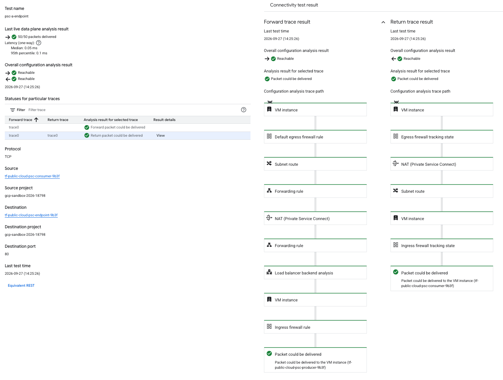
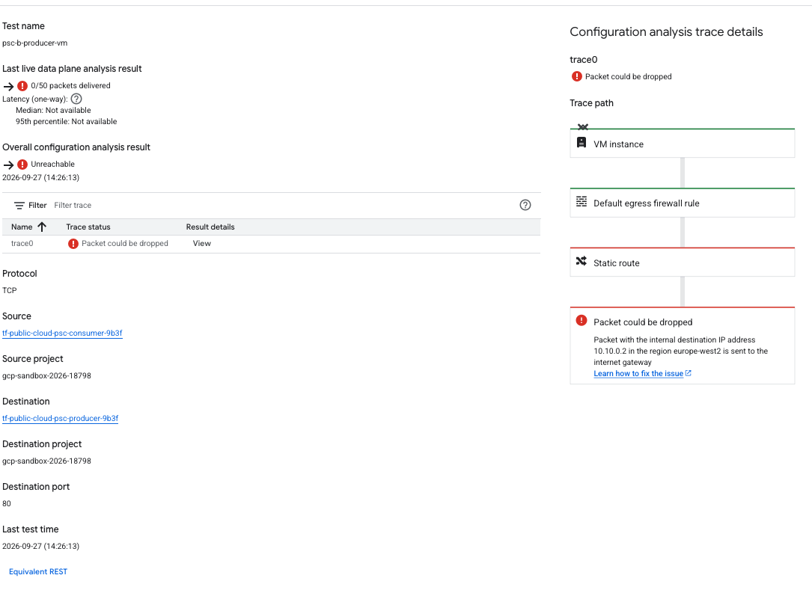

# Private Service Connect

- [Private Service Connect](#private-service-connect)
  - [Introduction](#introduction)
    - [What the example provisions](#what-the-example-provisions)
  - [Concepts and terminology](#concepts-and-terminology)
    - [Three different things are called PSC](#three-different-things-are-called-psc)
    - [Why a load balancer is mandatory](#why-a-load-balancer-is-mandatory)
    - [The NAT subnetwork](#the-nat-subnetwork)
    - [How a packet actually gets there](#how-a-packet-actually-gets-there)
  - [GCP — Private Service Connect](#gcp--private-service-connect)
    - [`gcp/private-service-connect`](#gcpprivate-service-connect)
    - [Key design decisions](#key-design-decisions)
  - [Deploying](#deploying)
    - [Via GitHub Actions (recommended)](#via-github-actions-recommended)
    - [Locally](#locally)
  - [Verifying](#verifying)
    - [What the script checks](#what-the-script-checks)
    - [Doing it by hand](#doing-it-by-hand)
    - [GCP's own analysis: Connectivity Tests](#gcps-own-analysis-connectivity-tests)
  - [Cleaning up](#cleaning-up)
  - [Other clouds](#other-clouds)

## Introduction

Private Service Connect (PSC) lets a service in one VPC be consumed from another VPC without
joining the two networks. No peering, no VPN, no shared route table, no overlapping-CIDR
negotiation, and no public IP on either side. The consumer reaches the service at an ordinary
internal address inside its *own* subnetwork.

This example builds **both halves** — the producer that publishes a service and the consumer that
connects to it — so the mechanism is visible rather than hidden behind a Google-managed service.



*Every IP range in the diagram belongs to a subnetwork, not to a network — GCP VPCs have no CIDR
of their own. The purple path is the only route between the two VPCs, and it is one-way. Note
what the producer sees at the far right: traffic arrives from `10.10.100.x`, never from the
consumer's own `10.20.0.x`, which is why the producer firewall must permit the NAT range.*

### What the example provisions

|                       | Producer VPC                                              | Consumer VPC                                     |
| --------------------- | --------------------------------------------------------- | ------------------------------------------------ |
| **Module path**       | `gcp/private-service-connect` (one root module, both VPCs) |                                                  |
| **Network**           | `…-producer-vpc-<hex>`, `auto_create_subnetworks = false` | `…-consumer-vpc-<hex>`                           |
| **Subnetworks**       | backend `10.10.0.0/24` + PSC NAT `10.10.100.0/24`         | `10.20.0.0/24`                                   |
| **Workload**          | `e2-micro` serving a static page on port 80               | `e2-micro` that curls the endpoint on boot       |
| **Load balancer**     | Regional internal passthrough NLB (L4, TCP:80)            | —                                                |
| **PSC resource**      | `google_compute_service_attachment`                       | `google_compute_forwarding_rule` (the endpoint)  |
| **Public IPs**        | None                                                      | None                                             |
| **Ingress rules**     | Health-check ranges + the PSC NAT range, both on TCP:80   | IAP TCP forwarding range on TCP:22               |
| **Resource count**    | 11                                                        | 6 (+1 `random_id`)                               |

## Concepts and terminology

### Three different things are called PSC

| Flavour                              | What it connects to                                | Built here |
| ------------------------------------ | -------------------------------------------------- | ---------- |
| PSC endpoint to Google APIs          | `storage.googleapis.com` and friends, privately    | No         |
| PSC endpoint to a Google-managed service | Cloud SQL, Memorystore, a partner service      | No         |
| **Published service**                | **A service you run, in a VPC you own**            | **Yes**    |

Only the third has a producer side you write yourself. The first two are easier to stand up but
Google owns the half that makes PSC interesting, so nothing about the mechanism is observable.

### Why a load balancer is mandatory

A service attachment can only target an **internal load balancer's forwarding rule**. It cannot
target an instance, an instance group, or an address. This is the single biggest reason a minimal
PSC demo is not three resources: a health check, a backend service and a forwarding rule all have
to exist before there is anything to publish.

This example uses a regional internal *passthrough* Network Load Balancer (L4). A regional
internal Application Load Balancer also works and gives you L7 routing, but it additionally
requires a proxy-only subnetwork.

### The NAT subnetwork

The producer needs a subnetwork with `purpose = "PRIVATE_SERVICE_CONNECT"`. It holds no
instances and takes no `role`. PSC source-NATs every consumer connection into this range before
it reaches the backend.

That translation is what makes PSC scale to consumers whose address space the producer knows
nothing about — including consumers whose ranges overlap each other, or overlap the producer's.
It also has two consequences worth internalising:

- **Producer firewall rules must permit the NAT range, not the consumer's range.** Permitting the
  consumer subnetwork instead produces a connection that reaches `ACCEPTED` at the control plane
  and times out at the data plane — a failure that looks like success from the Terraform output.
- **The producer never learns the client's real address.** Use the PSC connection ID for
  attribution instead.

### How a packet actually gets there



*Two packets leave the same VM, to the same next hop, over the same wire. One reaches the
service and one is dropped, and nothing in the guest distinguishes them.*

The consumer VM's address is a **/32**, so it has no concept of a local subnet. Its entire
routing table is a default route, a link route to the gateway, and the metadata server — every
packet is handed to `10.20.0.1` regardless of destination. `ip route get` returns identical
output for the PSC endpoint and for the producer VM.

`10.20.0.1` is not a device. It is Andromeda, Google's SDN, intercepting at the virtual NIC, and
every routing decision happens there. For the endpoint address it finds a **PSC mapping** —
the address is bound to the consumer forwarding rule, whose target is the service attachment —
and tunnels the flow across Google's fabric. That is not a route, which is why the consumer
VPC's route table contains nothing pointing at the producer, and why the two CIDR ranges would
be free to overlap. For the producer VM's own address it finds no route at all, and the packet
is dropped.

The practical consequence: **the consumer can reach the service and cannot reach the network
hosting it.** Verifying that requires a connection attempt, not a look at the guest's routing
table — see the note on check 5 in [Verifying](#verifying).

## GCP — Private Service Connect

### `gcp/private-service-connect`

**Required variables:**

- `project` — GCP project ID. CI injects this as `-var="project=…"`.

**Optional variables (all have defaults):**

- `region` — default `europe-west2`. Both VPCs, the load balancer and the endpoint must share one region.
- `zone` — default `europe-west2-b`. Only the instances and instance group are zonal, so a stockout in one zone is a one-line change that recreates nothing regional.
- `name_prefix` — default `tf-public-cloud-psc`. A random hex suffix is appended.
- `machine_type` — default `e2-micro` for both instances.
- `producer_cidr` — default `10.10.0.0/24`.
- `psc_nat_cidr` — default `10.10.100.0/24`.
- `consumer_cidr` — default `10.20.0.0/24`.
- `labels` — default `{}`, applied to both instances.

### Key design decisions

- **One project, two VPCs.** VPCs in a single project share nothing by default, so every property
  PSC provides is still demonstrated without the bootstrap, billing and IAM cost of a second
  project. The one thing this cannot show is a meaningful `ACCEPT_MANUAL` allow list, so the
  attachment uses `ACCEPT_AUTOMATIC`.
- **`python3 -m http.server` rather than nginx.** Debian 12 ships python3, so the producer needs
  no outbound internet access — and therefore no Cloud Router, no Cloud NAT and no public IP.
  `apt-get install nginx` would require all three, tripling the networking footprint of a module
  whose subject *is* networking.
- **`load_balancing_scheme = ""` on the consumer forwarding rule.** The empty string is what makes
  it a PSC endpoint rather than a load balancer. Any other value silently changes what you built.
  `ip_address` must also be the address resource's `id`, not its `.address` attribute.
- **No public IPs anywhere, and SSH only via IAP TCP forwarding** (`35.235.240.0/20`). A demo of
  private connectivity that reaches its test host over the internet would undercut its own point.
- **The consumer tests itself on boot.** A startup script curls the endpoint and writes one
  grep-able `PSC-TEST:` line to the serial console. This is the primary proof because it needs no
  SSH, no IAP role and no extra API — just `compute.instances.getSerialPortOutput`.
- **The producer's access log is mirrored to the serial console** (`StandardError=journal+console`
  on the systemd unit). That is how the demo proves source NAT without opening an SSH path into
  the producer VPC. Deliberately noisy; do not copy this into production.
- **Needs Service Directory, which `compute.admin` does not cover.** Everything else in the
  module — networks, subnetworks, firewalls, addresses, instances, instance groups, health
  checks, backend services, forwarding rules, the service attachment — falls under
  `roles/compute.admin`. But creating the consumer's PSC endpoint auto-registers it in a
  Service Directory namespace called `goog-psc-default`, which needs
  `servicedirectory.namespaces.create`. So this module adds `roles/servicedirectory.editor` to
  `scripts/iam/gcp-apply-permissions.json`, and `servicedirectory.googleapis.com` to the API list in
  `scripts/bootstrap/bootstrap-gcp.sh`. On an existing project both have to be applied by hand
  before the first apply — see [Deploying](#deploying).

## Deploying

### Via GitHub Actions (recommended)

**One-time prerequisites.** This module is the first to need Service Directory, so on a project
bootstrapped before it was added, enable the API and grant the role (both need project-admin
credentials, not CI's):

```sh
gcloud services enable servicedirectory.googleapis.com --project <project>

./scripts/bootstrap/apply-gcp-iam-bindings.sh \
  github-actions-tf-apply@<project>.iam.gserviceaccount.com \
  scripts/iam/gcp-apply-permissions.json
```

Plan uses read-only credentials and the `default` environment, so it runs from any branch:

```sh
gh workflow run plan-resource.yml \
  --field resource_type=private-service-connect --field cloud=gcp --ref <branch>
gh run watch
```

Apply and destroy use the `production` environment, which permits only refs matching
`release-*` and requires reviewer approval. Tag first, then dispatch against the tag:

```sh
git tag release-1.0.7
git push origin release-1.0.7

gh workflow run apply-resource.yml --ref release-1.0.7 \
  --field resource_type=private-service-connect --field cloud=gcp --field action=apply
```

See [docs/GitHub.md](GitHub.md) for the environment protection rules.

### Locally

```sh
cd gcp/private-service-connect
terraform init
terraform plan  -var="project=$(gcloud config get-value project)"
terraform apply -var="project=$(gcloud config get-value project)"
```

Expect 18 resources. The consumer instance's boot-time check retries for up to five minutes, so
allow a couple of minutes after apply before verifying — the backend has to pass its health check
first.

## Verifying

```sh
./scripts/examples/private-service-connect/gcp.sh
```

The script discovers everything by name via `gcloud`, so it needs no Terraform state access. It
exits non-zero if any hard assertion fails. Real captured output from a verified deployment is in
[scripts/sample-output/private-service-connect.md](../scripts/sample-output/private-service-connect.md),
along with a record of the three live-environment failures the first deployment hit — none of
which `terraform validate`, `tflint` or `terraform plan` could have caught.

### What the script checks

| # | Check                                                            | Hard assertion | Needs IAP SSH |
| - | ---------------------------------------------------------------- | -------------- | ------------- |
| 1 | Producer reports the consumer endpoint as `ACCEPTED`             | Yes            | No            |
| 2 | Consumer got HTTP 200 on boot (`PSC-TEST: 200` on serial console) | Yes           | No            |
| 3 | Producer's access log shows a source address in the NAT range, and never the consumer's own address | Yes | No |
| 4 | Neither network has any VPC peering                              | Yes            | No            |
| 5 | Consumer has no route into the producer VPC                      | No — skips     | Yes           |
| 6 | Live on-demand `curl` through the endpoint                       | No — skips     | Yes           |

**Check 5 is weaker than it looks.** It inspects the guest's routing table, but in GCP a VM has
a /32 address and a single default route, so `ip route get` returns the same next hop for *every*
destination — it would report exactly the same thing if the VPCs were peered. It proves the
guest makes no routing decision; it does not prove the producer VPC is unreachable. The
assertions that actually prove that are a connection attempt (`curl -m 5 http://10.10.0.2/`
must time out) and the VPC route table carrying no peering next hop. Replacing check 5 with
those two is tracked in
[docs/todo/post-apply-verification-in-ci.md](todo/post-apply-verification-in-ci.md).

Checks 5 and 6 need `roles/iap.tunnelResourceAccessor` on the caller and may need
`gcloud services enable iap.googleapis.com`. They are deliberately not load-bearing: checks 1–4
already prove the data path and the absence of any network join. On a verified run all seven
assertions pass with nothing skipped.

### Doing it by hand

```sh
cd gcp/private-service-connect
eval "$(terraform output -raw verify_command)"          # the boot-time result
terraform output psc_endpoint_ip                        # an address in the CONSUMER subnetwork
terraform output producer_instance_ip                   # an address the consumer cannot route to

# The producer's view of the client: a PSC NAT address, not the consumer VM
gcloud compute instances get-serial-port-output "$(terraform output -raw producer_instance_name)" \
  --zone europe-west2-b | grep 'GET / HTTP'

# What is NOT there
gcloud compute networks describe "$(terraform output -raw producer_network_name)" \
  --format='value(peerings[].name)'                     # empty

# Poke around from inside the consumer
gcloud compute ssh "$(terraform output -raw consumer_instance_name)" \
  --zone europe-west2-b --tunnel-through-iap
consumer$ curl "$(…psc_endpoint_ip)"                    # 200
consumer$ ip route get <producer_instance_ip>           # via the default gateway, no VPC route
consumer$ curl -m 5 <producer_instance_ip>              # times out — no path to the producer
```

The last two lines are the point of the whole module: the consumer can reach the *service* and
cannot reach the *network* hosting it.

### GCP's own analysis: Connectivity Tests

Network Intelligence Center's Connectivity Tests traces the path itself, which is worth doing
precisely because it is not this repo's code making the claim. It runs both a configuration
analysis and a live data plane probe.

**1. Enable the API** (not enabled by a default bootstrap):

```sh
gcloud services enable networkmanagement.googleapis.com --project <project>
```

**2. Discover the resource names**, the same way the verification script does:

```sh
PROJECT="$(gcloud config get-value project)"
REGION=europe-west2
ZONE=europe-west2-b
CONSUMER="$(gcloud compute instances list --filter="name~'tf-public-cloud-psc-consumer'" --format='value(name)')"
PRODUCER="$(gcloud compute instances list --filter="name~'tf-public-cloud-psc-producer'" --format='value(name)')"
ENDPOINT="$(gcloud compute forwarding-rules list --filter="name~'tf-public-cloud-psc-endpoint'" --format='value(name)')"
```

**3. Create one test per direction of the argument.** Test A goes to the PSC endpoint and should
be reachable; test B goes straight at the producer VM and should not be. `--round-trip` on A also
traces the return path.

```sh
gcloud network-management connectivity-tests create psc-a-endpoint --project="$PROJECT" \
  --source-instance=projects/$PROJECT/zones/$ZONE/instances/$CONSUMER \
  --destination-forwarding-rule=projects/$PROJECT/regions/$REGION/forwardingRules/$ENDPOINT \
  --protocol=TCP --destination-port=80 --round-trip

gcloud network-management connectivity-tests create psc-b-producer-vm --project="$PROJECT" \
  --source-instance=projects/$PROJECT/zones/$ZONE/instances/$CONSUMER \
  --destination-instance=projects/$PROJECT/zones/$ZONE/instances/$PRODUCER \
  --protocol=TCP --destination-port=80
```

Each create blocks for a minute or so while the analysis runs.

**4. Where to find the results.** In the console, **Network Intelligence → Connectivity Tests**:

```
https://console.cloud.google.com/net-intelligence/connectivity/tests/list?project=<project>
```

Click the test name for the summary, then **Result details → View** on a trace row to open the
*Configuration analysis trace details* panel, which draws the hop-by-hop path. A `--round-trip`
test shows two columns, *Forward trace result* and *Return trace result*.

From the CLI, the verdict and the trace are both on the resource:

```sh
gcloud network-management connectivity-tests describe psc-a-endpoint \
  --project="$PROJECT" --format='value(reachabilityDetails.result)'

gcloud network-management connectivity-tests describe psc-a-endpoint \
  --project="$PROJECT" --format='json(reachabilityDetails.traces)'
```

#### Test A — to the PSC endpoint



*Reachable both ways, and 50/50 packets delivered at 0.05 ms median — a live data plane result,
not only a configuration analysis. The forward trace names the hops GCP actually walks: subnet
route, forwarding rule, **NAT (Private Service Connect)**, forwarding rule, load balancer backend
analysis. The return trace runs the same hops in reverse with the NAT undone.*

#### Test B — straight at the producer VM



*Unreachable, 0/50 packets delivered, latency not available. The trace stops after three hops:
VM instance, default egress firewall rule, **static route** — then drops, with the reason spelled
out as "Packet with the internal destination IP address 10.10.0.2 in the region europe-west2 is
sent to the internet gateway".*

#### Reading the two together

The fork is visible in a single word. Both packets leave the same VM and pass the same egress
firewall rule, then:

| | Route hop GCP matches | Outcome |
|---|---|---|
| A → `10.20.0.2` | **Subnet route** — the consumer's own `10.20.0.0/24`, because the endpoint address is local | Forwarding rule takes over, PSC NAT, delivered |
| B → `10.10.0.2` | **Static route** — `0.0.0.0/0` to the internet gateway, the only thing that matches | Dropped: `PRIVATE_TRAFFIC_TO_INTERNET` |

No peering hop appears in either trace, and no route covering `10.10.0.0/24` exists in the
consumer VPC. Packet B is not blocked by a firewall — egress is allowed — it simply has nowhere
to go, so the default route sends it at the internet gateway, which discards it for carrying an
RFC1918 destination.

**5. Delete both tests** when finished; they carry a small per-test charge:

```sh
gcloud network-management connectivity-tests delete psc-a-endpoint   --project="$PROJECT" --quiet
gcloud network-management connectivity-tests delete psc-b-producer-vm --project="$PROJECT" --quiet
```

## Cleaning up

```sh
gh workflow run apply-resource.yml --ref release-1.0.7 \
  --field resource_type=private-service-connect --field cloud=gcp --field action=destroy
```

PSC endpoints bill per hour on top of the two `e2-micro` instances and the internal forwarding
rule, so do not leave this applied.

`terraform destroy` removes all 18 resources, but **one thing survives it**: the Service
Directory namespace `goog-psc-default`, created automatically when the endpoint was created and
never owned by Terraform. It is left empty and costs nothing, and a later deployment reuses it.
Remove it by hand if you want the project genuinely clean:

```sh
gcloud service-directory namespaces delete goog-psc-default \
  --location <region> --project <project>
```

## Other clouds

The AWS and Azure analogues — PrivateLink endpoint services, and Private Link Service behind a
Standard Load Balancer — are **not built in this repo**. This example is GCP-only, so nothing
here should be read as a three-way comparison.
